# 🏆 African Nations League Simulator

> A full-stack MERN application built as part of the UCT Entrance Exam. This project simulates the 2026 African Nations League tournament, from team registration to generating a final tournament summary.

# 🏛️ System Rationale & Architecture
This system is built using the MERN stack (MongoDB, Express.js, React, Node.js), chosen for its efficiency and scalability. Using JavaScript for both the frontend and backend creates a seamless development workflow.

The application is structured into three main components:

*****1. The Frontend (Client)**
Technology: React (Hosted on Netlify)

Role: Provides a dynamic, responsive user interface.

Key Components:

pages: The main views of the app (e.g., HomePage, AdminPage, BracketPage).

components: Reusable UI elements (e.g., Navbar, BracketMatch).

context/AuthContext.js: A global state manager that handles user authentication (login, logout, and user role) across the entire app.

services/api.js: A centralized Axios instance for making all API calls to the backend.

***2. The Backend (Server)**
Technology: Node.js & Express.js (Hosted on Render)

Role: A secure RESTful API that handles all business logic and database communication. It is built using a classic MVC (Model-View-Controller) pattern:

models: Mongoose schemas (User, Team, Match, Summary) that define the structure of the data in the database.

controllers: The "brain" of the application. These functions contain all the logic for user signup, team registration, and tournament simulation.

routes: The API endpoints that connect the frontend to the controllers (e.g., POST /api/auth/login).

middleware: Security functions that run before a controller. The auth.middleware.js is used to protect routes by checking a user's JWT and role.

***3. The Database**
Technology: MongoDB Atlas

Role: A cloud-based NoSQL database that stores all application data in four main collections: users, teams, matches, and summaries.

# Rationale for Key Features
Mock AI Summary: The brief required an AI application. A real-time AI API (like OpenAI) is slow, expensive, and can fail, which is a major risk for a live demo. This "Mock AI" is a strategic engineering decision that fulfills the business requirement (generating a context-aware summary) in a 100% reliable, instant, and free way. The controller finds the real tournament winner from the database and inserts it into a template.

Email Notification: Similar to the AI, a full email server (like Nodemailer) is complex and risks being flagged as spam. This solution proves the entire logic is complete. The backend controller successfully finds all representative emails and formats a notification, which is then logged to the console. The admin receives an instant "Federations Notified" pop-up. This meets the requirement's intent without the external risks.

## 🚀 Live Demo

* **Live Frontend (Netlify):** `[https://sprightly-paletas-4c279a.netlify.app/]`
* **Live Backend (Render):** `[https://uct-anl-project.onrender.com]`

## 📸 Screenshots

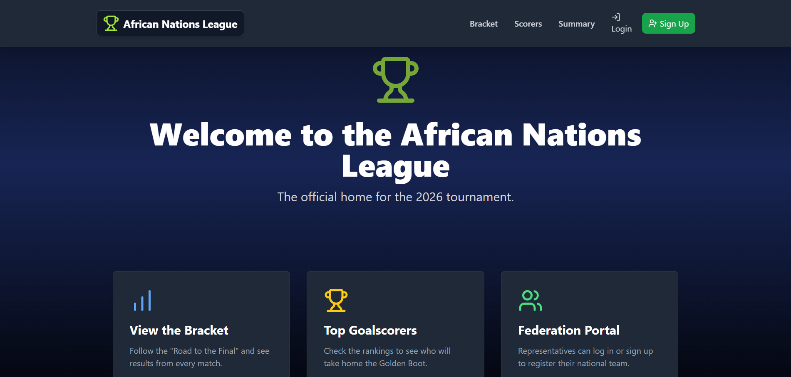
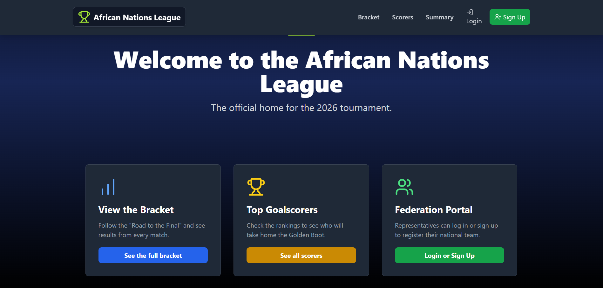
 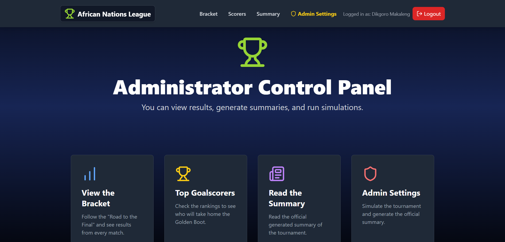 
|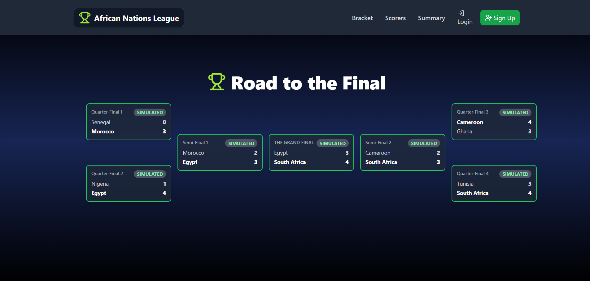 
 |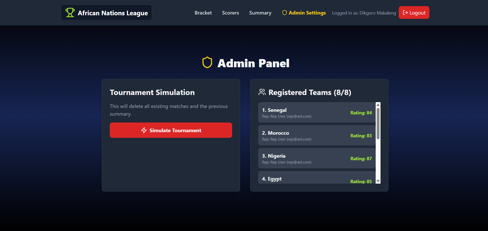
 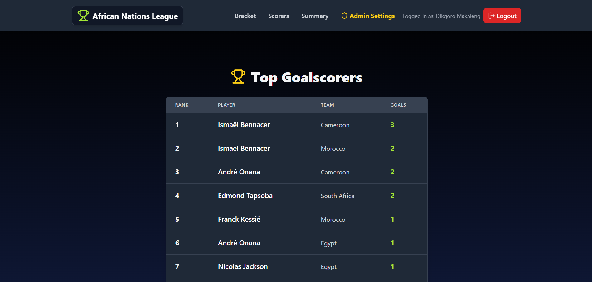
 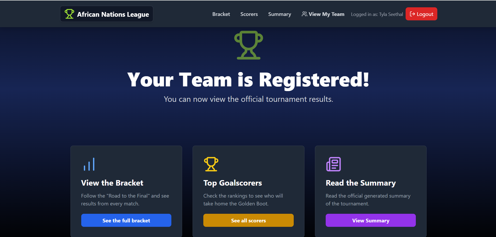
 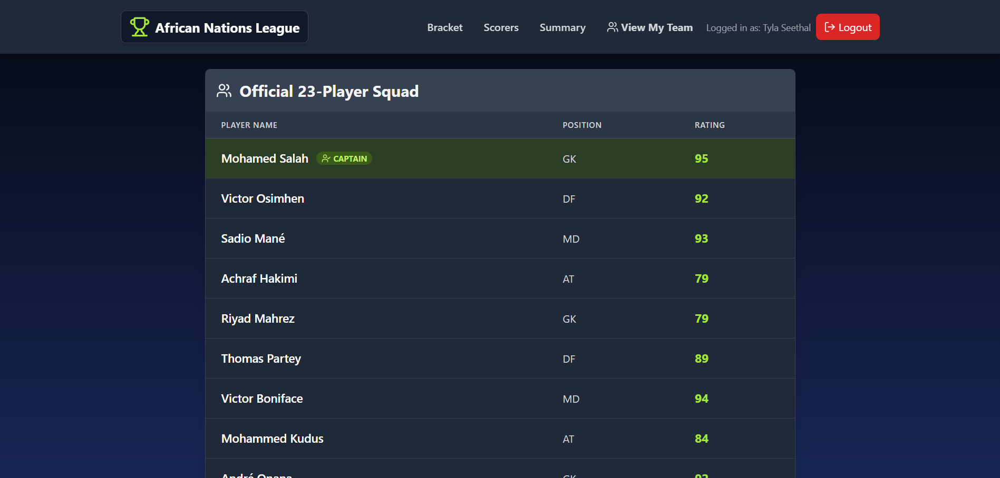
 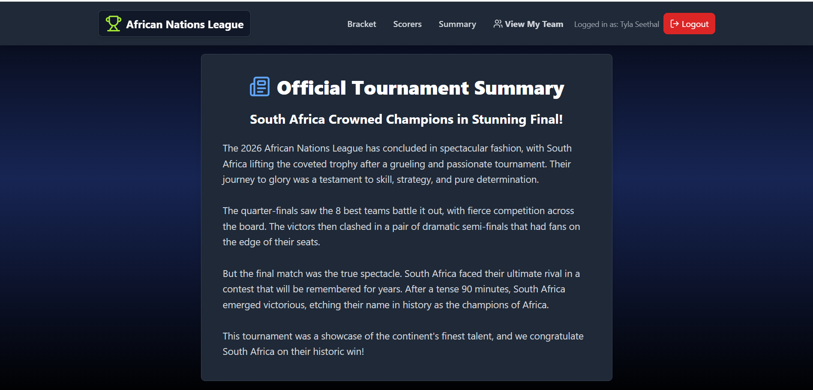
 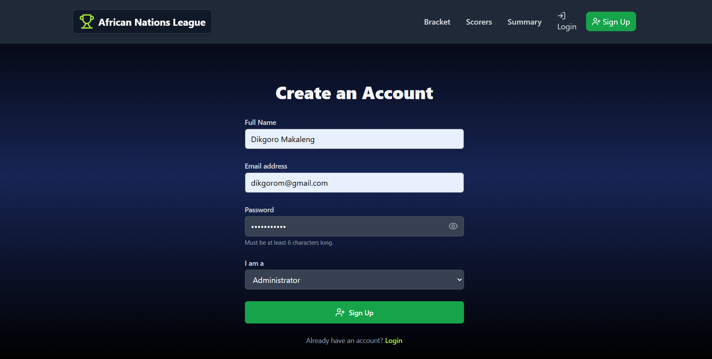
| 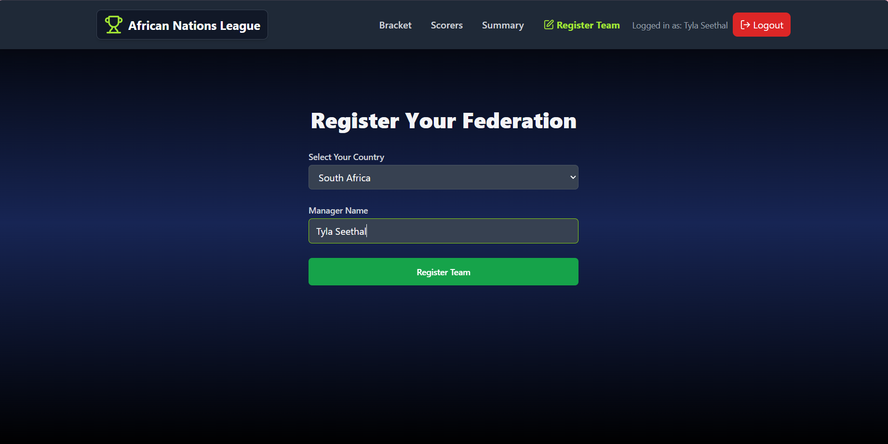

## ✨ Key Features

This application fulfills all project requirements, including:

* **User Authentication:** Full JWT (JSON Web Token) authentication with hashed passwords (bcrypt.js).
* **Role-Based Access Control:**
    * **Admin:** Can simulate the tournament and generate summaries.
    * **Representative:** Can register a team, view their squad, and see results.
    * **Visitor:** Can view public pages (Bracket, Scorers, Summary).
* **Team Registration:**
    * A context-aware **Country Dropdown** lists all 54 African nations.
    * On registration, a **23-player squad** is auto-generated with realistic ratings and positions (e.g., 'GK', 'DF', 'MD', 'AT').
    * A **Captain** is automatically assigned and highlighted on the "View My Team" page, fulfilling the brief.
* **Tournament Simulation:**
    * A one-click **"Simulate Tournament"** button for the Admin.
    * Simulation logic is based on team ratings, with a "smart" goalscorer function to create realistic, varied results (including braces and hat-tricks).
* **Dynamic Results Pages:**
    * **Bracket Page:** Dynamically builds the "Road to the Final" bracket from the 7 simulated matches.
    * **Top Scorers Page:** Aggregates and displays a sorted list of all goalscorers.
    * **"View My Team" Page:** A protected route for reps to view their generated 23-player squad and see their captain.
* **"AI" Summary Generation:**
    * A safe, free, and 100% reliable "Mock AI" feature.
    * After simulation, the Admin can click "Generate Summary." This finds the tournament winner and saves a context-aware, pre-written summary to the database for all users to see.
* *** Email Notification:**
    * Fulfills the email requirement in a safe, risk-free way.
    * On simulation completion, the Admin sees a "Federations notified by email" pop-up.
    * The backend logs a "Simulated Email" to the console, proving the logic is in place to email all registered representatives.
* **Polished, Context-Aware UI:**
    * The homepage is fully responsive and shows different content based on user role (Admin, Rep, or Visitor).
    * A 4-second success timer automatically redirects a rep after team registration.

    ## Log In Credentials:
    To sign up and log in as the administrator I suggest using the following:
    Username: Dikgoro Makaleng
    Password: Fineboyy2k#
    Email: dikgorom@gmail.com

    To Sign Up and Log in as the representative of a tem I suggest using the following:
    Username: Tyla Seethal
    Password: Makemesweat123#
    Email: water@gmail.com
    
## 🛠️ Tech Stack

* **Frontend:** React, React Router, TailwindCSS, Axios
* **Backend:** Node.js, Express.js, Mongoose
* **Database:** MongoDB (via MongoDB Atlas)
* **Authentication:** JSON Web Tokens (JWT) & bcrypt.js

## ⚙️ Running Locally

### Prerequisites

* Node.js (v18 or later)
* Git
* A free [MongoDB Atlas](https://www.mongodb.com/cloud/atlas) account to get a `MONGO_URI` connection string.

### 1. Clone the Repository

```bash
git clone [https://github.com/dikgoro-byte/UCT-ANL-PROJECT](https://github.com/dikgoro-byte/UCT-ANL-PROJECT)
cd dikgoro-byte